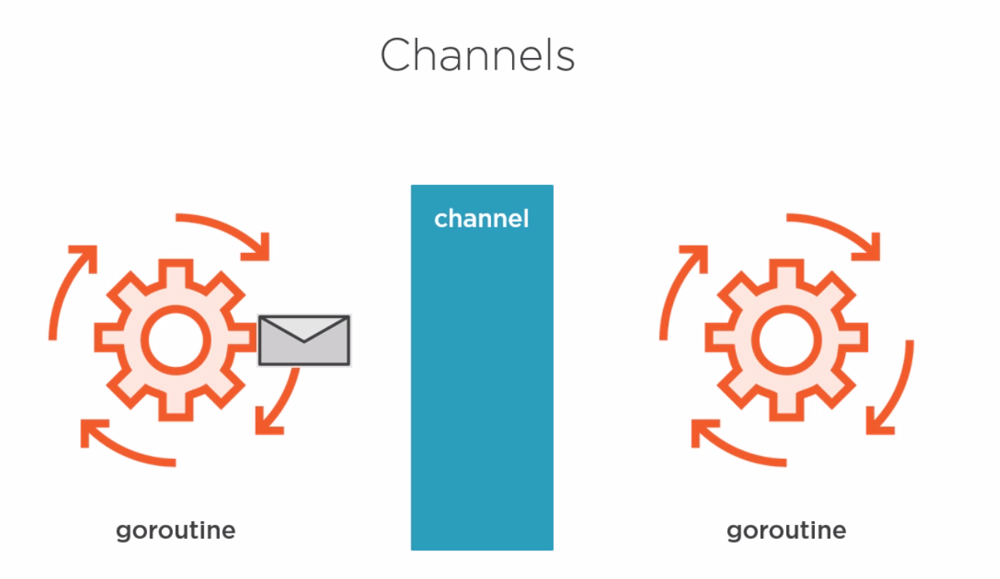

# go-concurrent-example

1. Challenges with Concurrency
    1. Coordinating tasks 
       * WaitGroups
       * Channels 
    2. Shared memory
       * Mutexes
       * Channels 
    
2. Mutex
    * A mutual exclusion lock
    Showing the date races\
    `go run --race .`
      
3. Channels

   1. Channel Types
        * `func myFunc(ch chan int) { ... } // bidirectional channel`
        * `func myFunc(ch chan<- int) { ... } // send-only channel`
        * `func myFunc(ch <-chan int) { ... } // receive-only channel`